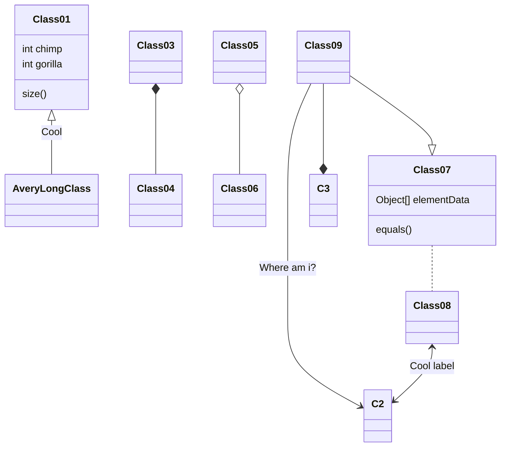

# rust-inheritance
This is a small repo for me to learn the rust language. It focuses on inheritance.

## What it shows

It shows how to use inheritance in rust to build the following class hierarchy:

