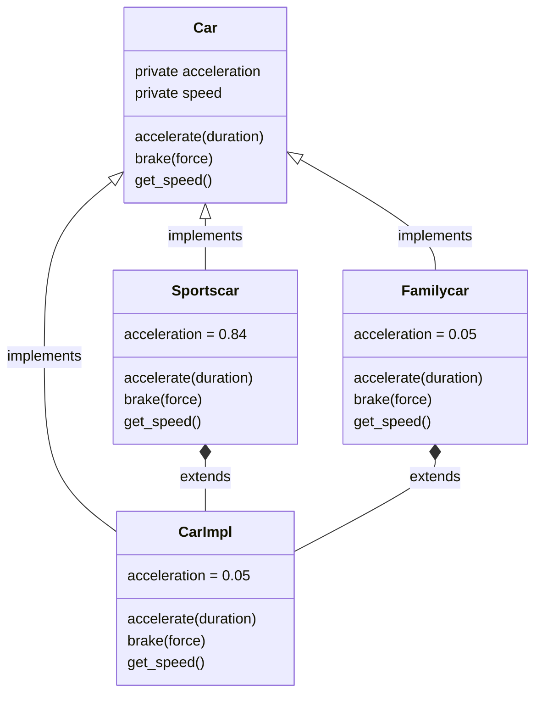

# rust-inheritance

This is a small repo for me to learn the rust language. I used it to study how to implement inheritance and polymorphism in Rust.

```
     ____________________________
    / Hello, I come from C++     \
    | and this is the first time |
    \ that I program in Rust.    /
     ----------------------------
            \
             \
                _~^~^~_
            \) /  o o  \ (/
              '_   -   _'
              / '-----' \
```

## Pre-requisites

You need to have rust installed. You can get it from [here](https://www.rust-lang.org/tools/install).

## How to run

```bash
cargo run
```

## What it shows

It shows how to use inheritance in rust to build the following class hierarchy:



The program pupulates a dynamic array with cars of type `Sportscar` and `Familycar` and calls the methods of the `Car` trait (like `accelerate()` or `break()`) on them.	


